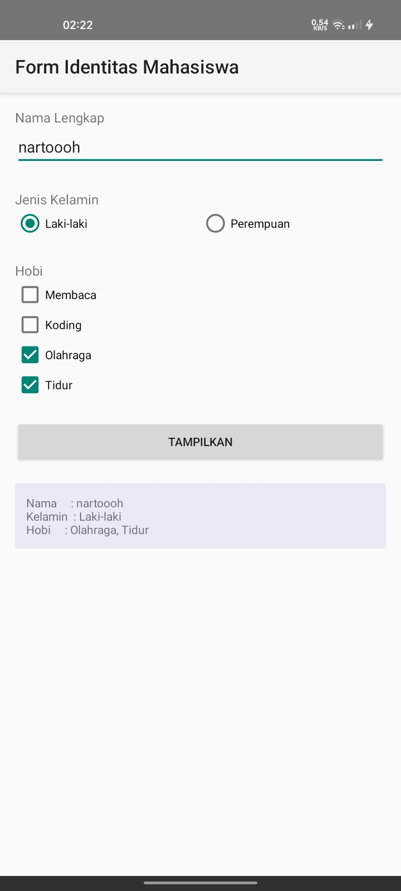
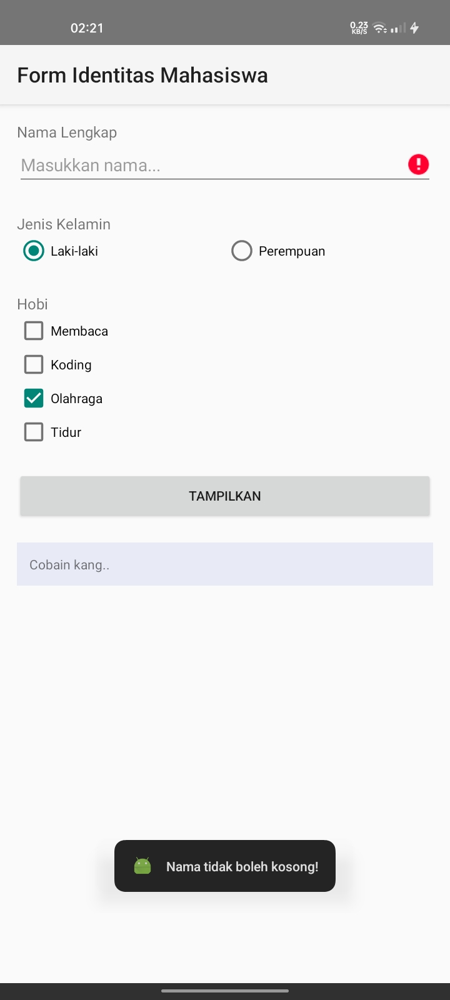
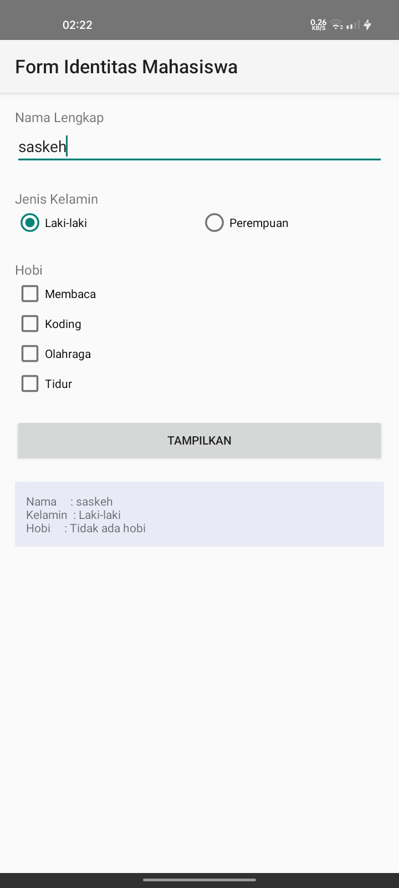

# Tugas Praktikum 3

Tugas Praktikum 3 Pemrograman Mobile: Layout & Basic Widgets.

> Name: UMAM ALPARIZI  
> NIM: F1D02310141

## Screenshot Aplikasi

Menampilkan form identitas mahasiswa dengan layout yang rapi.

Menampilkan pesan error jika nama dikosongkan.

Menampilkan hasil jika semua data terisi namun tidak ada hobi yang dipilih.

